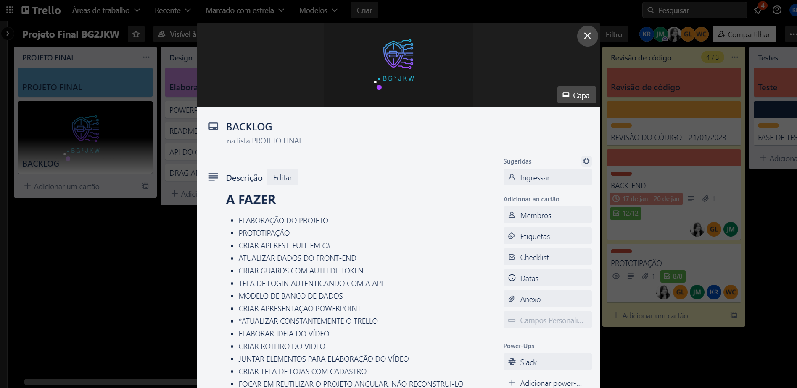
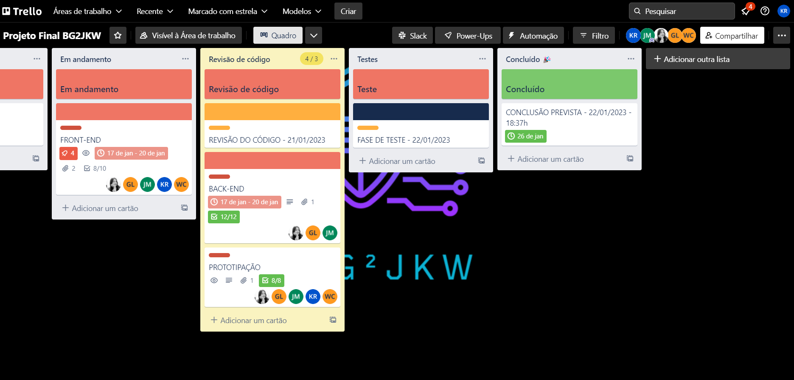
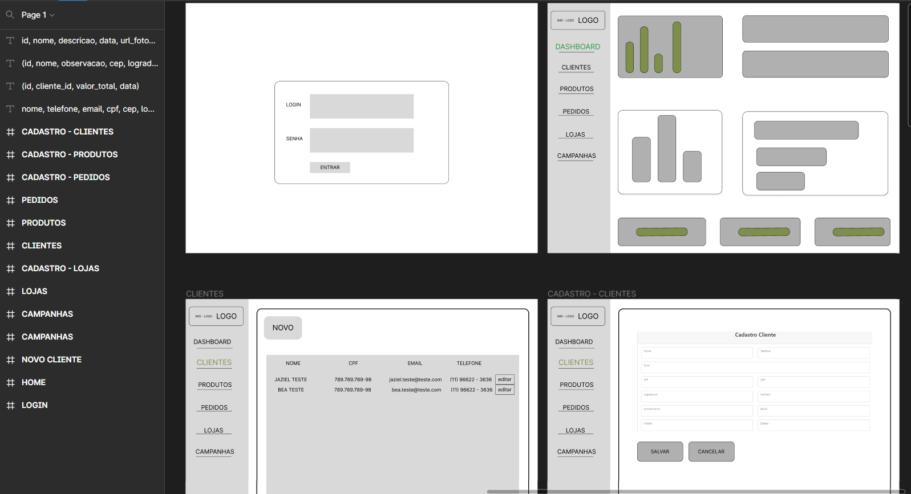
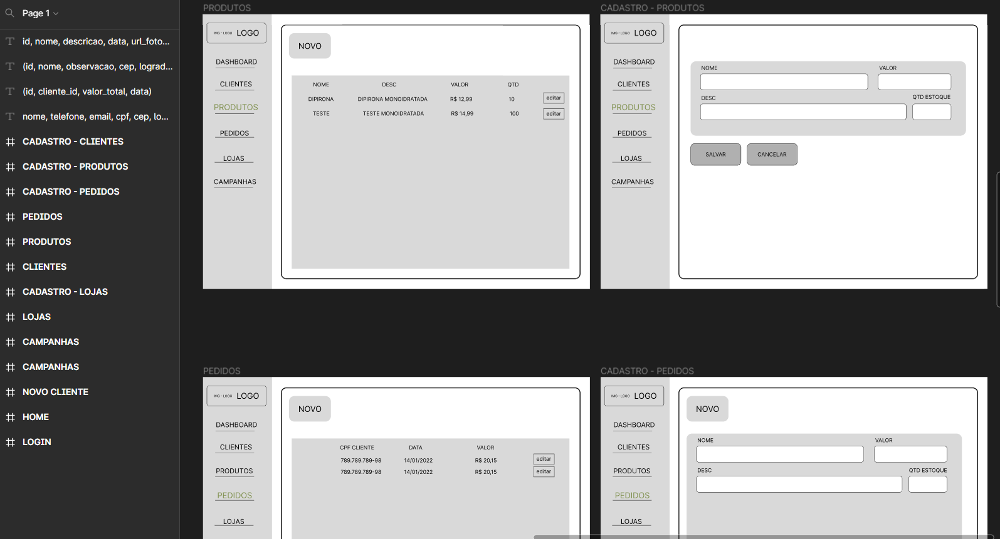
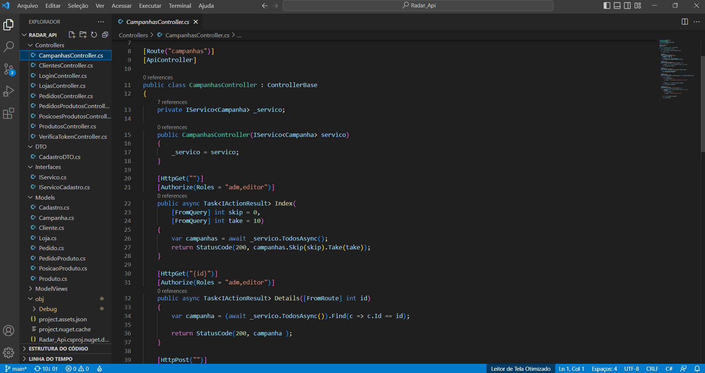
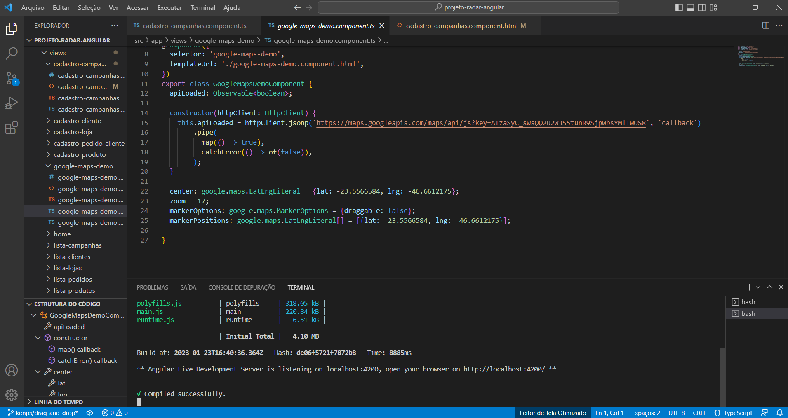
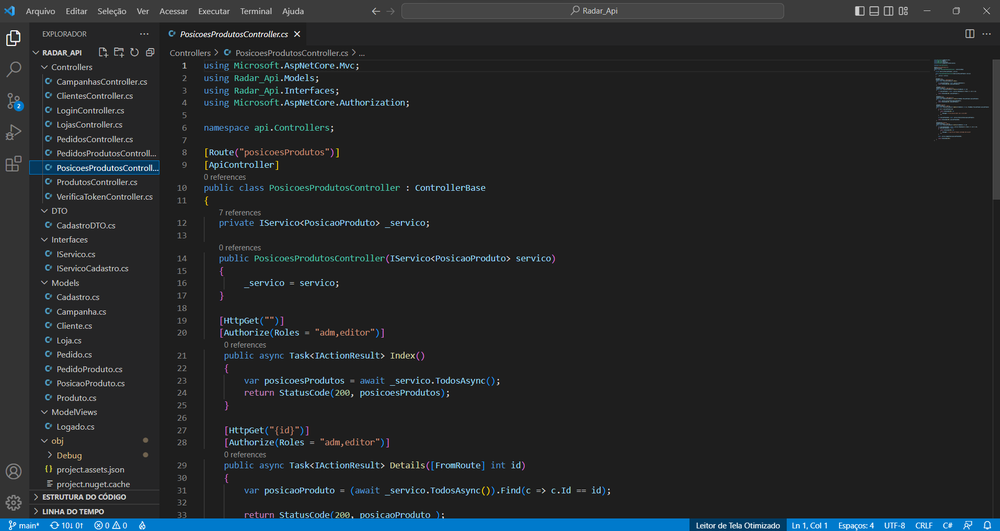
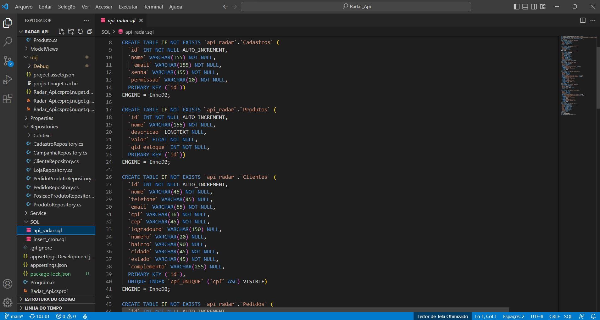

|  |  |  | |  
|--- |--- |--- |--- |--- |
|[**Farmarcas**](https://www.farmarcas.com.br/ "Site da Da Farmarcas") | [**Febrafar**](https://www.febrafar.com.br/ "Site da Da Febrafar") | [**Gama Academy**](https://www.gama.academy/ "Site da Da Gama Academy") |  [*Professor Danilo*](https://www.linkedin.com/in/danilo-aparecido-dos-santos-03101034/)| [**Código do Futuro**](https://codigodofuturo.corporate.gama.academy/)


 
 
# :accept: Projeto Radar :satellite: :cyclone: [](https://github.LICENSE) 
<h1 align="left">Olá , somos o grupo BG2JKW</h1>
<p align="left"> </p>                      


<br>
<br>
<br>


#  :large_orange_diamond: Autores :


| |  ||  | |  
|:--:|:--:|:--:|:--:|:--:|
|*Beatriz Miotto*|*Jaziel Matos*|*Gustavo Lima*|*Kenps Rossi*|*Wallace Cocuzza*|
|[](https://www.linkedin.com/in/beatriz-miotto-8025b7200/)|[](https://www.linkedin.com/in/jaziel-matos-7b7256212/) |[](https://www.linkedin.com/in/gustavo-salgado-lima/) |[](https://www.linkedin.com/in/kenps-adv-dev/) |[](https://www.linkedin.com/in/wcocuzza/)


#  :large_orange_diamond: Sobre o Projeto :  :page_with_curl:

Radar é uma projeto do programa de treinamento do [*Código do Futuro*](https://codigodofuturo.corporate.gama.academy/), uma excelente iniciativa da [**Farmarcas**](https://www.farmarcas.com.br/ "Site da Da Farmarcas") e da [**Febrafar**](https://www.febrafar.com.br/ "Site da Da Febrafar") em <br>  parceria com à conceituada startup de educação [**Gama Academy**](https://www.gama.academy/ "Site da Da Gama Academy"), foram mais de 170 horas de capacitação, somando-se ainda, aulas e mentorias divididas em 11 semanas com módulos ao vivo ministradas pelo exímio professor referência na área [*Danilo Aparecido dos Santos*](https://www.linkedin.com/in/danilo-aparecido-dos-santos-03101034/). <br>   Objetivando preparar desenvolvedores FullStack Jr nas linguagens .Net e Angular, colocando em prática soft skills importantes como: trabalho em equipe; observância de prazos e entrega de demandas; desenvolvimento de raciocínio lógico; interpretação de problemas trazendo soluções; pensamento crítico apresentando resoluções inovadoras e atitudes positivas diante dos desafios.

O projeto **Radar** consiste na junção do projeto front-end já desenvolvido no primeiro desafio com o projeto back-end AspNet core API C#, permitindo desse modo o controle interno
sobre as informações do sistema radar, que tem como funcionalidades:

:small_orange_diamond: Pagina login ;  :white_check_mark:                                                

:small_orange_diamond: Página home ;  :white_check_mark:

:small_orange_diamond: Página cadastro de produtos ; :white_check_mark:

:small_orange_diamond: Página cadastro de clientes ; :white_check_mark:

:small_orange_diamond: Página cadastro de pedidos dos clientes ; :white_check_mark:

:small_orange_diamond: Página de fluxo de caixa ; :white_check_mark:

:small_orange_diamond: Página cadastro de lojas ; :white_check_mark:

:small_orange_diamond: Página de fluxo de caixa ; :white_check_mark:

:small_orange_diamond: Página para organização dos produtos das lojas ; :white_check_mark:

:small_orange_diamond: Disponibilidade de posicionamento dos produtos em prateleiras objetivando propiciar criação de campanhas . :white_check_mark:

- Compreende ainda funcionalidades extras como :

:small_orange_diamond: Autenticação JWT na API ; :white_check_mark:

:small_orange_diamond: Testes de unidade e funcionalidades ; :white_check_mark:

:small_orange_diamond: Utilização da API de consulta de CEP br para códigos de endereçamento ; :white_check_mark:

:small_orange_diamond: Utilização da API do google maps para mostrar os pontos da loja no mapa . :white_check_mark:


   <a href="https://www.youtube.com/" target="_blank"></a>


#  :large_orange_diamond: Organização do Projeto :  :clipboard:
- Elaboramos o kanban utilizando o Trello ;
- Criamos prototipação ;
- Criamos o backlog ;
- Detalhamos o descritivo das tarefas da squad dentro dos seus cards ;
- Formatamos do kanban padrão "to do, doing, done" ;
- Definimos as datas de entrega das tarefas nos cards ;
- Definimos cada responsável pelo card ou checklist de completude ;
- Priorizamos os cards através de etiquetas coloridas que definiam níveis de dificuldade e níveis de prioridade .


#  :large_orange_diamond: Layout do Trello : :bookmark_tabs:







#  :large_orange_diamond: Modelo Conceitual/Prototipação: :pencil:
:part_alternation_mark:**Modelo conceitual do banco de dados**


:part_alternation_mark:**Modelo lógico do banco de dados**


:part_alternation_mark:**Prototipação**


:part_alternation_mark:**Prototipação**



#  :large_orange_diamond: Layout do Código : 


:notebook_with_decorative_cover:***Radar Angular***


:notebook_with_decorative_cover:***Radar API***


:notebook_with_decorative_cover:***Radar API***


:notebook_with_decorative_cover:***Radar API***



#  :large_orange_diamond: Layout do Site : :pager:

:computer: ***Site página 1...***


:computer: ***Site página 2...***


:computer: ***Site página 3...***


:computer: ***Site página 4...***


##  :large_orange_diamond: Tecnologias utilizadas : :calling:


- **HTML**   


- **CSS**  


- **TypeScript**    

- **JavaScript** 


- **Angular**  


- **.Net** 


- **C#**   


- **AspNet core**  


- **Banco de dados MySQL** 

         
- **Testes com UnitTest**    
        


# :large_orange_diamond: Como executar o Projeto : :bulb:

##  :flashlight: Back end :
- Pré-requisitos : 

```bash
# clonar repositório
git clone https://github.com/BG2JKW/Radar_Api

# entrar na pasta do projeto Radar_Api

# instalar dependências
...

# executar o projeto
...
```

##  :flashlight: Front end web :
- Pré-requisitos : 

```bash
# clonar repositório
git clone https://github.com/BG2JKW/projeto-radar-angular

# entrar na pasta do projeto projeto-Radar-angular

# instalar dependências
...

# executar o projeto
...
```
